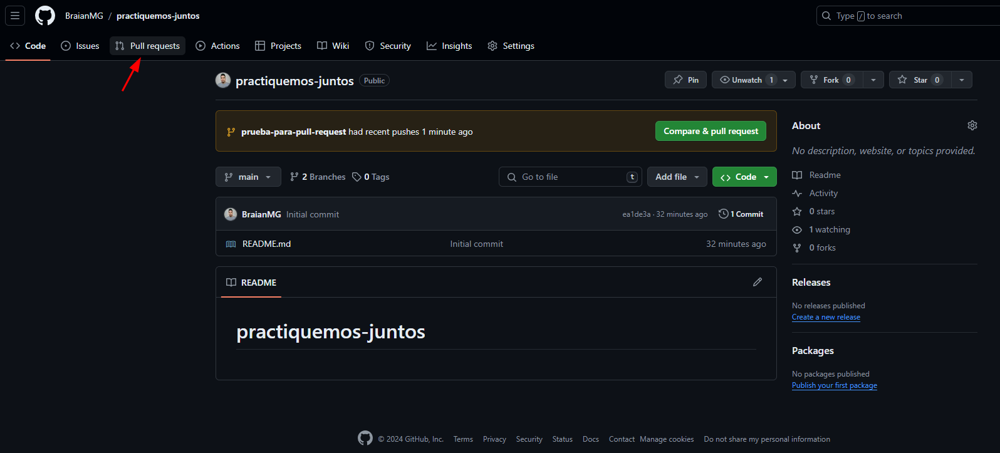
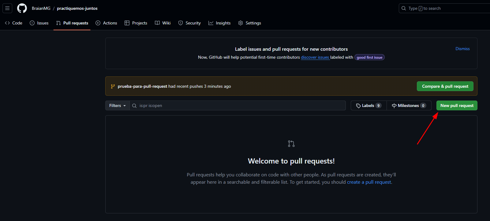
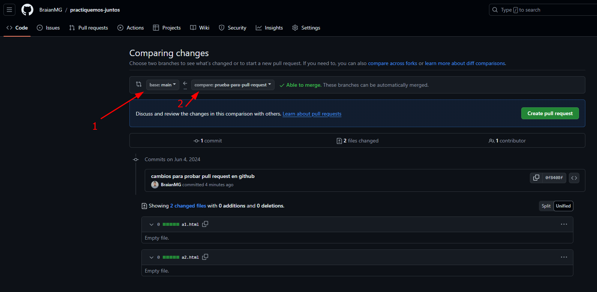
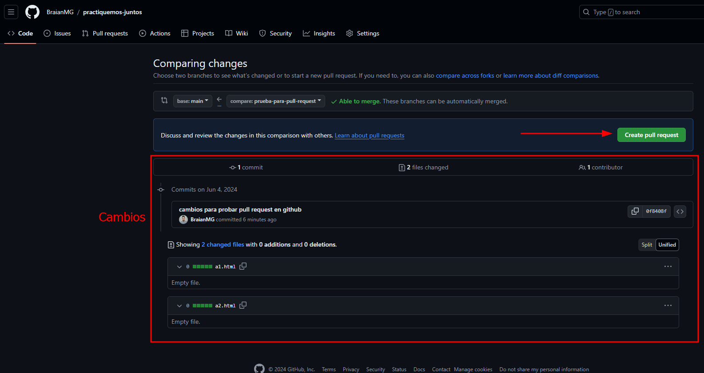
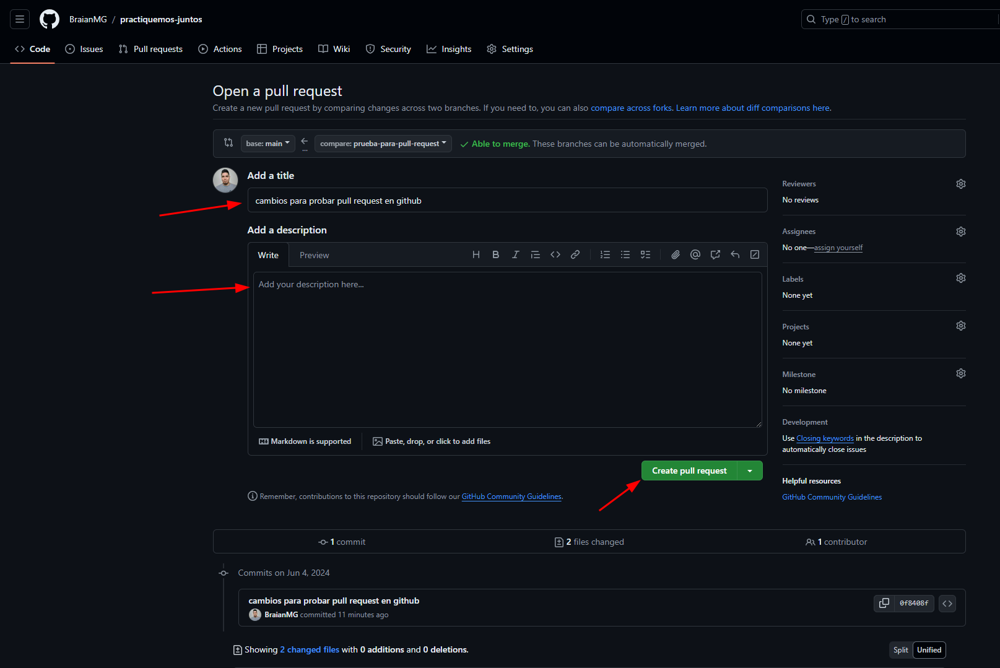
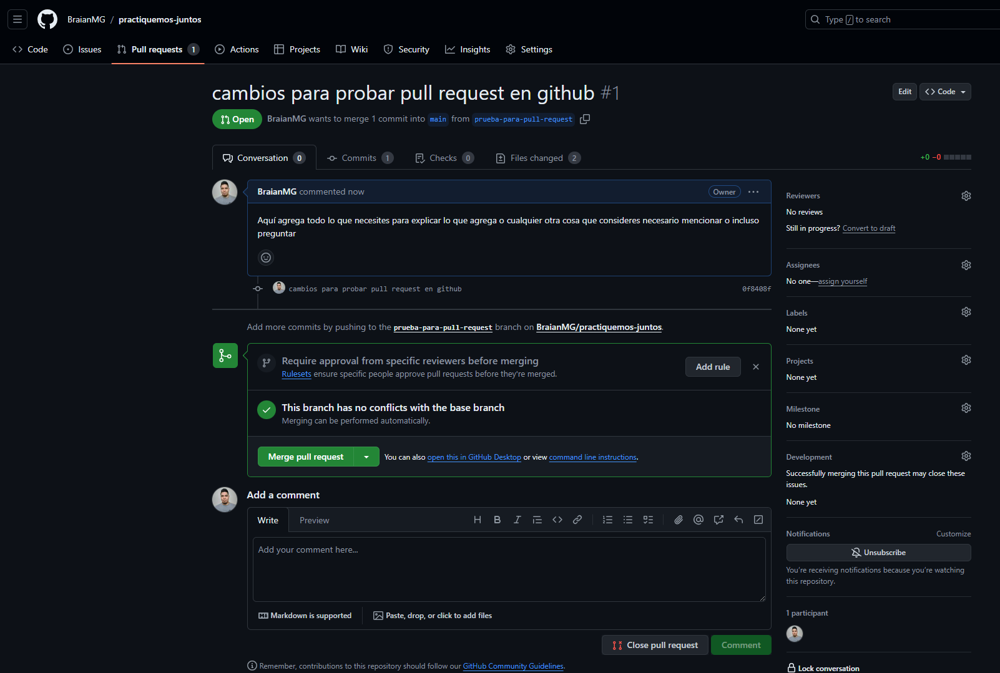
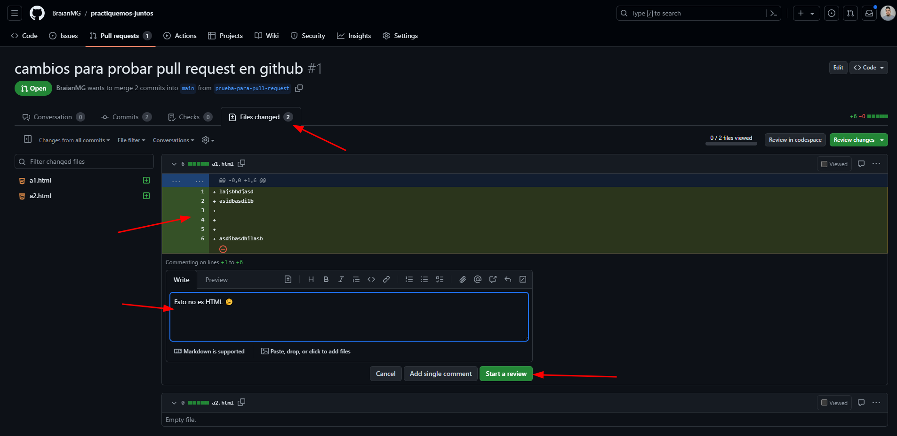

# Practiquemos Juntos

## Uso de Git
1. Clonar este repo: `git clone https://github.com/BraianMG/practiquemos-juntos.git`
2. Revisar en qué rama estamos, seguramente estemos en `main` si no lo estamos nos movemos a esa rama `git checkout main`
3. De la rama actual crear una nueva y movernos a ella para trabajar lo nuevo allí: `git checkout -b nombre-de-la-nueva-rama`
4. De aquí en adelante lo podemos hacer todo desde la interfaz de VScode o como se explica a continuación con línea de comandos
5. Para agregar cambios al __stage__ (zona en la que ponemos los cambios que próximamente confirmaremos):
   - Para agregar todos los cambios: `git add .`
   - Para agregar los cambios de algunos archivos: `git add archivo-a archivo-b archivo-c`
6. Para sacar cambios de __stage__:
   - Para sacar todos los cambios: `git restore --staged .`
   - Para sacar los cambios de algunos archivos: `git restore --staged archivo-a archivo-b archivo-c`
7. Para commitear (confirmar) los cambios agregados al __stage__: `git commit -m"Mensaje del commit explicando brevemente lo que agrega"`
8. Para pushear los cambios al repositorio remoto: `git push -u origin nombre-de-la-rama`

## Crear un Pull Request en GitHub
Luego de haber pusheado la nueva rama al repositorio remoto iremos al [repo en GitHub](https://github.com/BraianMG/practiquemos-juntos) y daremos clic en la opción `"Pull Requests"`

Luego en `"New pull request"`

1. Seleccionamos la rama destino donde queremos agregar cambios
2. Seleccionamos la rama que contiene los nuevos cambiso que queremos agregar

Para estar seguros de que seleccionamos correctamente las ramas podemos ver los cambios que aplicaremos, luego damos clic en `"Create pull request"`

Podemos indicar un título (toma el que hayamos escrito en el mensaje del commit) y una descripción para aclarar de que se tratan los cambios o cualquier otra cosa que sea necesario. Finalmente damos clic en `"Create pull request"`

La pull request quedara creada a la espera de una code review y que finalmente quien tenga permiso suficientes la mergee

En el tab `"Files changed"` podemos agregar comentarios sobre las líneas de código que deseemos haciendo clic sobre una línea específica o clicando y arrastrando las N líneas que querramos comentar, luego escribimos el comentario y damos clic en `"Start a review"`

