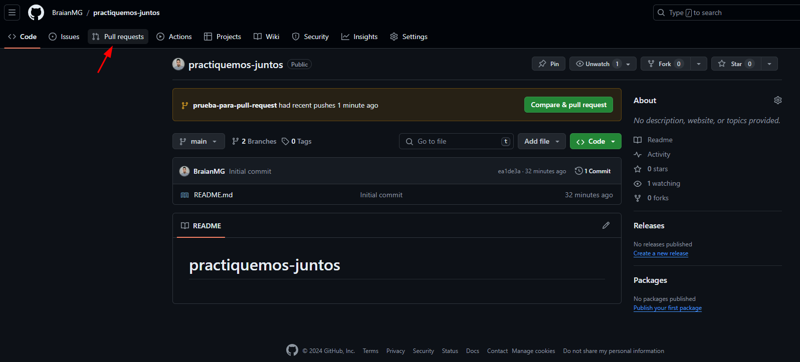
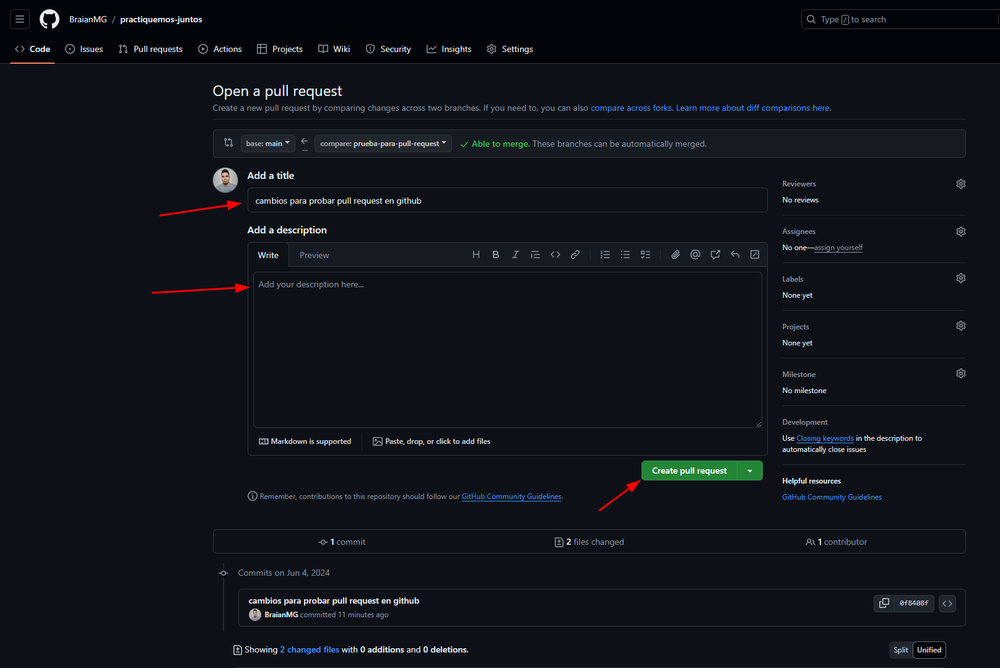
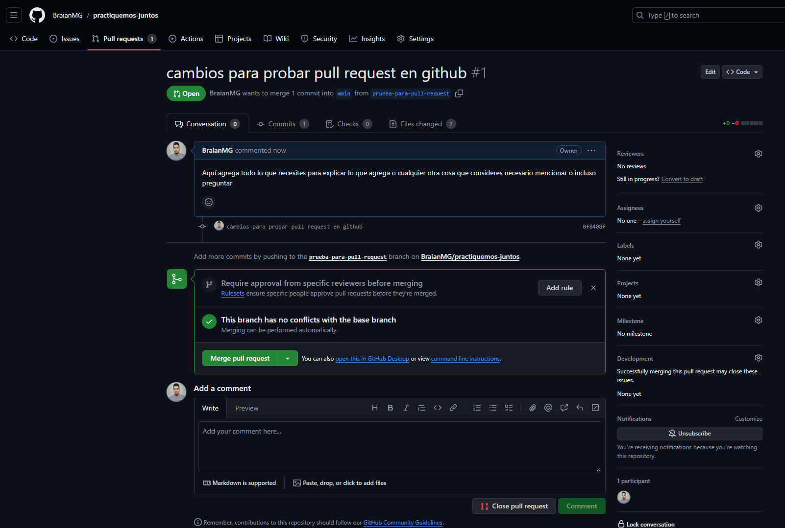
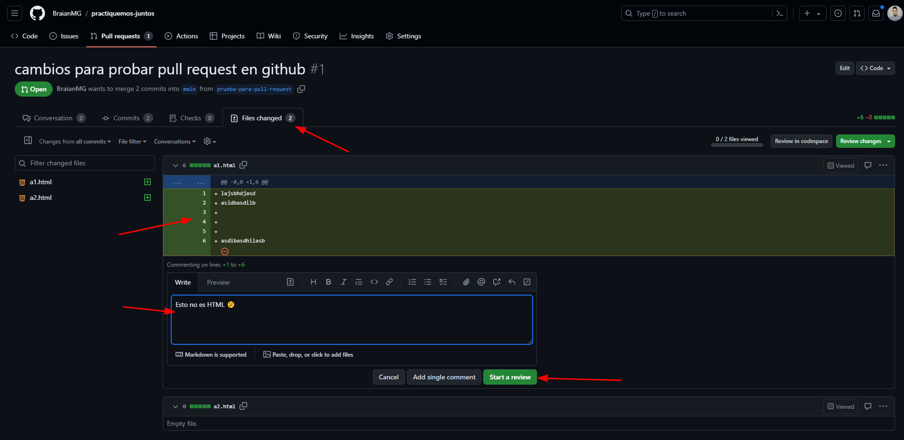

# Crear una Pull Request en GitHub

Luego de haber pusheado la nueva rama al repositorio remoto iremos al [repo en GitHub](https://github.com/BraianMG/practiquemos-juntos) y daremos clic en la opción `"Pull Requests"`

Luego en `"New pull request"`

1. Seleccionamos la rama destino donde queremos agregar cambios
2. Seleccionamos la rama que contiene los nuevos cambiso que queremos agregar

Para estar seguros de que seleccionamos correctamente las ramas podemos ver los cambios que aplicaremos, luego damos clic en `"Create pull request"`

Podemos indicar un título (toma el que hayamos escrito en el mensaje del commit) y una descripción para aclarar de que se tratan los cambios o cualquier otra cosa que sea necesario. Finalmente damos clic en `"Create pull request"`

La pull request quedara creada a la espera de una code review y que finalmente quien tenga permiso suficientes la mergee

En el tab `"Files changed"` podemos agregar comentarios sobre las líneas de código que deseemos haciendo clic sobre una línea específica o clicando y arrastrando las N líneas que querramos comentar, luego escribimos el comentario y damos clic en `"Start a review"`

