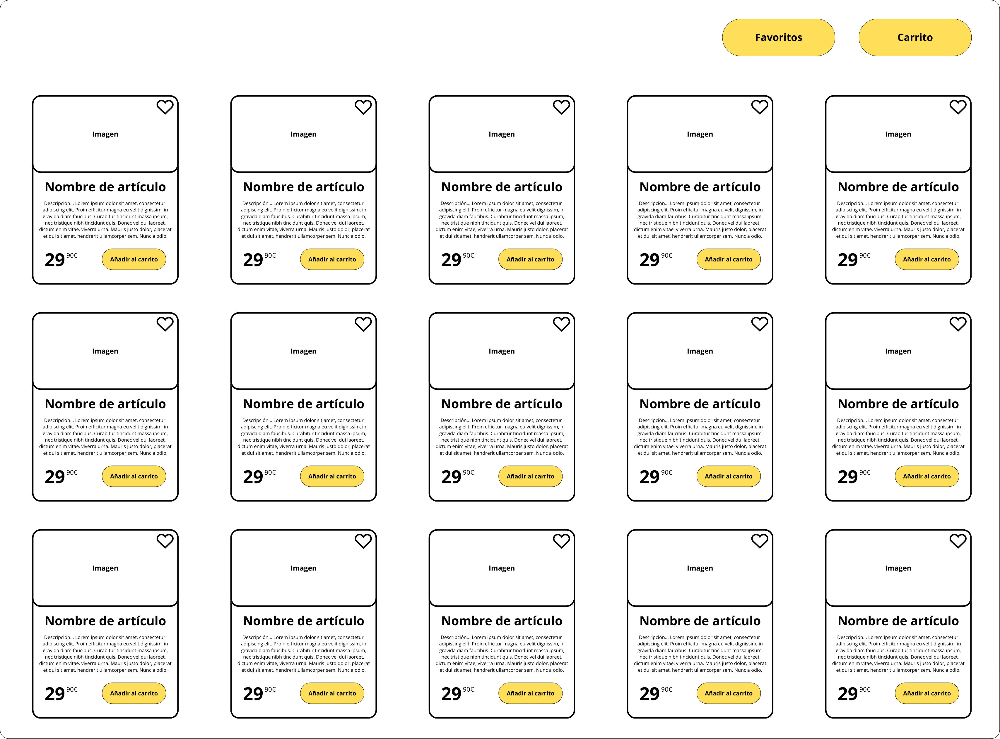
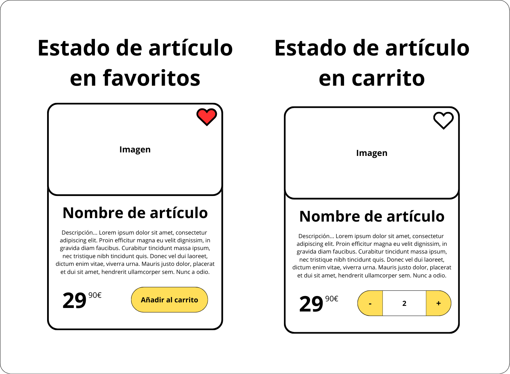
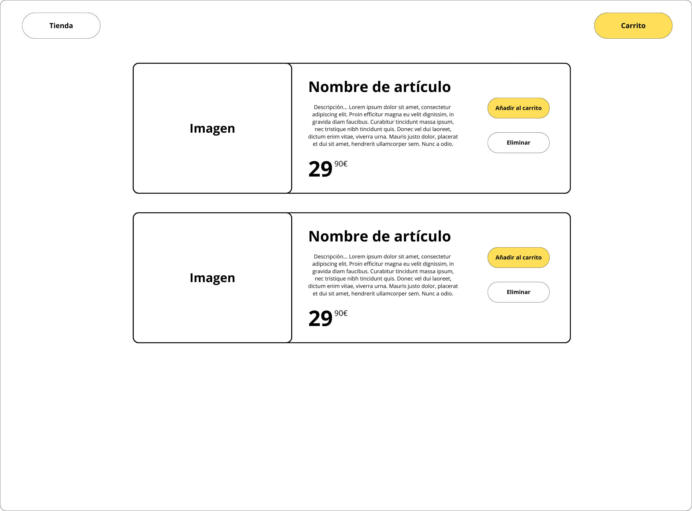
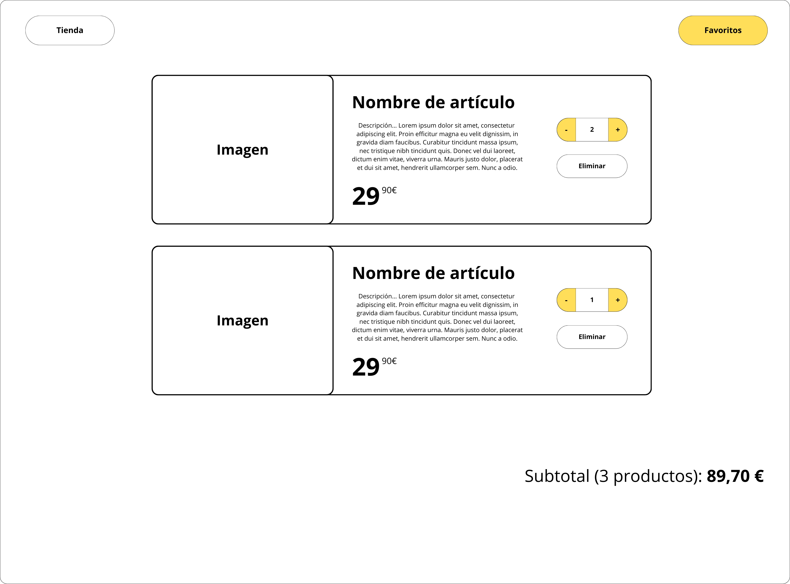

# Mini eCommerce

Reperesentar la siguiente `UI`:

Los `estados de las cards` son los siguientes:

Al dar clic en `Favoritos` se debe ver lo siguiente:

Al dar clic en `Carrito` se debe ver lo siguiente:

Al dar clic en `Tienda` se debe volver a la vista principal.

La lista de favoritos y de articulos en el carrito __`deben persistir`__ si el usuario recarga la página, para esto se puede utilizar `localStorage`.

No es necesario crear otras páginas, se puede hacer como una __`SPA`__ (Single Page Application), mostrando y ocultando elementos según sea necesario.

No es necesario que se siga el diseño al pie de la letra, eres libre de hacer cambios mientras se mantengan las funcionalidades y finalidad de cada vista.

Todo debe ser __`100% responsive`__.
